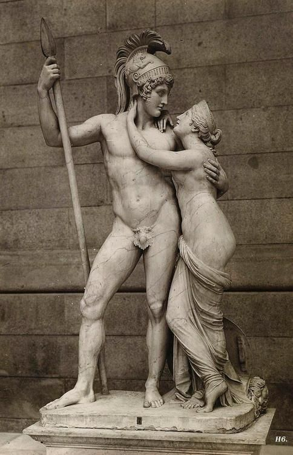
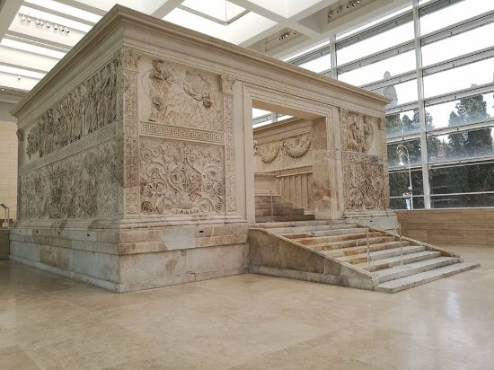

# rim_kraljevina.html

## 1 (5.0)

Dokončna indoevropeizacija Apeninskega polotoka je bila izvedena v času železne dobe, Apeninski polotok, Sicilijo, Sardinijo in Korziko so poseljevala različna ljudstva, med njimi tudi italska plemena. Označite pet italskih plemen, ki so poseljevala območje sodobne Italije in Korzike.

- **Umbrijci**

- **Sabinci**

- **Samniti**

- **Latinci**

- **Sikuli**
## 2 (1.0)

S pomočjo zemljevida različnim plemenom antične Italije dodelite območje poselitve.

**Italiki** → **osrednja Italija**

**Etruščani** → **ozemlje med rekama Arno in Tibero**

**Kartažani** → **zahodna Sicilija**

**Grki** → **jug Italije in vzhodna Sicilija**

**Kelti** → **sever Italije**

**Veneti** → **Padska nižina**
## 3 (3.0)

Na Apeninskem polotoku je v starem veku živelo ogromno plemen. Poimenujte skupino plemen, po katerih se danes imenuje Italija.

**Italiki**
## 4 (1.0)

Navedite skupno ime za območje grških kolonij na jugu Italije in Sicilije.

**Velika Grčija**
## 5 (3.0)

Označite šest kolonij na področju Velike Grčije.

- **Tarent**

- **Neapolis**

- **Sirakuze**

- **Kume**

- **Kroton**

- **Pestum**
## 6 (1.0)

Poimenujte grškega antičnega znanstvenika iz Sirakuz, ki je ugotovil, da je teža potopljenega telesa za toliko manjša, kolikor je teža izpodrinjene tekočine.

**Arhimed**
## 7 (2.0)

Na kulturni in politični razvoj Rima so močno vplivali Grki oziroma Etruščani.
Navedite štiri elemente, ki so jih Rimljani prevzeli od Grkov.

- **oljka**

- **tri oblike kapitlja**

- **dvanajst vrhovnih bogov**

- **pisava**
## 8 (5.0)

Izvor **Etruščani**, ki so poselili območje severne Italije (Etrurija), še ni popolnoma razjasnjen. Prva teorija govori, da so **Etruščani** staroselci  (Dionizij), druga teorija pa pravi, da so prišli
iz Male Azije (Herodot). Prvi teoriji v prid govore ostanki naselij, ki
so tod obstajala že v **bronasta** dobi, drugo teorijo pa dokazujejo
elementi kulture **Etruščani**, ki so sorodni tistim iz Male Azije. Središče **Etruščani** je bila pokrajina **Toskana**. Gospodarstvo je temeljilo na poljedelstvu, živinoreji,
rudarstvu (železo, baker, kositer, zlato), trgovini in pomorstvu. Zaradi
 delitve dela so se pojavila mesta in podeželska naselja. Podobno kot v **Grčija** se je tudi tu razvilo večje število mest z okolico, ki so
delovala kot država v malem. Ta mesta so se občasno povezovala v zveze z
 vojaškimi cilji. Zaradi delitve dela in proizvajanja presežkov v gospodarstvu ter
zbiranja vojnega plena, se je družba začela **razslojevanje**. Sprva so
mestom poveljevali **kralj**, sčasoma pa se je okrepila aristokracija
(plemstvo) ter na oblasti zamenjala **kralj**.
## 9 (1.0)

Označite današnjo italijansko pokrajino, ki je domovina Etruščanov.

- **Toskana**
## 10 (3.0)

Na kulturni in politični razvoj Rima so močno vplivali Grki oziroma Etruščani.
Navedite šest elementov, ki so jih Rimljani prevzeli od
Etruščanov.

- **polkrožni obok**

- **triumf**

- **fasces**

- **prerokovanje iz leta ptic in drobovja živali**

- **gladiatorski boji**

- **gradnja cest**
## 11 (1.0)

Glede na slikovni vir označite element etruščanske kulture, ki so ga prevzeli Rimljani.

- **nekropola**
## 12 (1.0)

Na sliki je upodobljen sarkofag zakonskega para iz 6. st. pr. n. š., ki sta živela na področju Etrurije. Ali drži trditev, da je sarkofag materialni dokaz o enakopravnosti žensk v etruščanski družbi?

**Drži**
## 13 (1.0)

Večina znanstvenikov domneva, da etruščanski jezik ni indoevropski, zato se etruščanska besedila zelo težko berejo. V pomoč branju njihovih besedil je pisava, ki so jo Etruščani prevzeli od ________________.

- **Grkov**
## 14 (5.0)

Enako kot Grki tudi Etruščani niso nikoli izoblikovali enotne države, pač pa so živeli v mestnih državah, ki so jim sprva načelovali kralji. Simbole etruščanskih kraljev so kasneje prevzeli rimski cesarji. Katerih pet prepoznate?

- **zlati venec**

- **škrlatna toga**

- **dvokolesni bojni voz**

- **žezlo s podobo orlove glave**

- **fasces**
## 15 (1.0)

Po legendi o nastanku Rima sta Rimljane ščitila dva božanska prednika. Označite božanstvi, ki sta bila prastarša rimskega ljudstva.

- **Venera**

- **Mars**
## 16 (1.0)

Navedite avtorja epa Eneida, v katerem je bil pojasnjen trojanski izvor rimskega ljudstva.

**Vergilij**
## 17 (1.0)

Rimljani so verjeli, da so potomci iz Troje pobeglega princa Odgovor Vprašanje 17, katerega mati je bila Afrodita (Venera). Preživeli Trojanec se je ustalil v latinskem mestu Alba Longa.

**Eneja**
## 18 (3.0)

S pomočjo slikovnega gradiva rešite nalogo o ustanovitvi mesta Rim.Obstaja več legend o ustanovitvi mesta Rim, a v cesarskem obdobju se je uveljavilo delo **Eneida**, ki je začetke Rima pojasnilo z uničenjem mesta **Troja**. Ključen dogodek za ustanovitev mesta Rim je srečanje Reje Silvije, ki je bila **vestalka** - torej svečenica, ki je morala skrbeti za ognjišče v templju, in boga **Mars**. Iz te zveze sta se rodila dvojčka Romul in Rem, ki sta bila ob rojstvu izpostavljena na reki **Tibera**, rešila pa ju je volkulja. Dvojčka sta odraščala med pastirji, kasneje pa sta ustanovila mesto Rim, a Romul je ubil Rema, Rimu pa je zavladal kot prvi **kralj**.
## 19 (7.0)

Rim se v je 1. tisočletju pr. n. š. pojavil kot naselje, v katerem so prebivali poljedelci in pastirji iz plemena **Latini**. V 8. stoletju pr. n. š. je Rim dobil prvo obzidje. Iz tega časa izhaja legenda o **Romul** in Remu, po kateri naj bi mladi **Romul** leta **753** pr. n. š. ustanovil Rim.
 Mesto se je razvilo na sedmih gričih, kateri se nahajajo v bližini
izliva reke **Tibera** v Tirensko morje. Na gričih so se naselili zaradi
pogosto poplavljajoče reke **Tibera**, dežela pa je znana pod imenom **Lacij**.
## 20 (1.0)

Po legendi o Romulu in Remu je bil Rim ustanovljen Odgovor Vprašanje 20 pr. n. š. 

**753**
## 21 (1.0)

Iz katerega etruščanskega mesta izhaja Kapitolska volkulja, ki je rešila Romula in Rema?

**Veji**
## 22 (3.0)

Mesto Rim je bilo ustanovljeno ob dveh važnih transportnih poteh: plovna pot po reki Tiberi in pot soli. Mesto se je s Palatina postopoma razširilo na preostalih šest gričev. Označite jih.

- **Kvirinal**

- **Viminal**

- **Eskvilin**

- **Celij**

- **Palatin**

- **Aventin**
## 23 (1.0)

Rim je bil sprva mestna država z monarhično obliko ureditve. Po izročilu je v Rimu vladalo sedem kraljev. Kdo je bil prvi kralj?

**Romul**
## 24 (1.0)

Rim je bil sprva mestna država z monarhično obliko ureditve. Po izročilu je v Rimu vladalo sedem kraljev, zadnji trije so bili po poreklu Etruščani. Kdo je zadnji rimski kralj?

**Tarkvinij Ošabni**
## 25 (3.0)

Položaj kraljev v Rimu ni bil deden niti niso imeli popolne oblasti, saj so vladali skupaj s senatom. Katere tri veje oblasti pa so posedovali rimski kralji?

- **verska oblast**

- **vojaška oblast**

- **sodna oblast**
## 26 (1.0)

Rim kot kraljevina preneha obstajati 509 pr. n. š. Zakaj so patriciji odstranili Tarkvinija Ošabnega?

- **Vladal je kot tiran.**

---

# rim_republika.html

## 1 (1.0)

Rim kot kraljevina preneha obstajati 509 pr. n. š. Zakaj so patriciji odstranili Tarkvinija Ošabnega?

- **Vladal je kot tiran.**
## 2 (5.0)

Rimska družba se je glede na poreklo in premoženje delila na dva družbena sloja: patriciji in plebejci. Opise povežite s pripadajočim družbenim slojem.

**Bili so potomci prvih naseljencev.** → **patriciji**

**Bili so potomci priseljencev.** → **plebejci**

**Imeli so vse politične pravice.** → **patriciji**

**Bili so brez političnih pravic.** → **plebejci**

**Plačevali so visoke davke.** → **plebejci**

**Plačevali so nizke davke.** → **patriciji**

**Lahko so bili člani senata.** → **patriciji**

**Bili so lastniki veleposesti.** → **patriciji**

**Med njimi je bilo veliko kmetov.** → **plebejci**

**Ukvarjali so se z obrtjo in trgovino.** → **plebejci**
## 3 (6.0)

Po padcu zadnjega rimskega kralja so Rimljani leta **509** pr. n. š. razglasili republiko. Od tedaj naprej so oblast volili. Najvišji politični organ v državi je bil **senat**, ki je sprva štel **300** mož. Člani **senat** so bili poglavarji plemiških družin in nekdanji uradniki. Senat je sodeloval z magistratom (vlado), ki je štel dva **konzula**, pretorje (2 do 6), cenzorje (različno število), kvestorje (4 do 20) in edile (4). Funkcije v magistratu so bile izbrane za dobo **eno** leta. Na čelu republike sta bila dva **konzula**, katera sta bila izbrana iz
vrst **patriciji** (šele leta 367 pr. n. š. je bilo dovoljeno izbrati enega
od **konzula** iz vrst plebejcev). **konzula** sta imela najvišjo vojaško,
sodno in finančno oblast ter neomejeno upravno oblast. Sprva sta bila
tudi vojaška poveljnika z neomejeno oblastjo, kasneje pa ju v času vojne
 zamenja **diktator**. Vrhovni svečenik se je imenoval **pontifex maximus**.
## 4 (1.0)

Rimska republika je obstajala od 509 pr. n. š. do 27 pr. n. š. Iz katere besedne zveze izhaja izraz republika?

- **Res Publica**
## 5 (1.0)

Najvišji politični organ v rimski republiki je bil Odgovor Vprašanje 5.

**senat**
## 6 (1.0)

V rimski republiki sta najvišjo vojaško, sodno in politično oblast imela dva Odgovor Vprašanje 6.

**konzula**
## 7 (1.0)

Kako imenujemo magistrata oz. državnega uradnika, ki ga je v času hude zunanje grožnje imenoval senat. Na položaju je bil pol leta, imel pa je pooblastila za vodenje države.

**diktator**
## 8 (1.0)

Kateri simbol oblasti so nosili liktorji, kadar so spremljali konzula?

**fasces**
## 9 (1.0)

Leta 494 pr. n. š., kmalu po vzpostavitvi republike, so se plebejci uprli
zaradi kopičenja zemlje v rokah patricijev in zaradi večanja števila
siromašnih plebejcev. Plebejci iz protesta niso hoteli sodelovati v
vojaškem pohodu na nasprotnika, sočasno pa so grozili z izselitvijo iz Rima. Patriciji so se bali okoliških plemen, obenem pa so se zavedali, da so plebejci poglavitna delovna sila in plačniki davkov, zato so
ugodili njihovim zahtevam. Plebejci so dobili svojo ljudsko skupščino (plebejska skupščina). Dobili pa so tudi dva zagovornika njihovih pravic. Kako sta se imenovala?

**ljudska tribuna**
## 10 (3.0)

Plebejci so patricijem grozili z izselitvijo iz Rima. V primeru izselitve bi rimska republika izgubila tri četrtine vojske in davkov, zato so patriciji popustili, plebejci pa so dobili dva ljudska tribuna. Označite tri pravilne trditve, ki opisujejo ljudske tribune.

- **Ljudska tribuna sta imela pravico veta.**

- **Ljudska tribuna sta lahko ugovarjala sklepom senata in konzulov.**

- **Moč ljudskih tribunov je bila uveljavljena le, če sta oba uporabila pravico veta.**
## 11 (5.0)

Nasprotja med patriciji in plebejci so se razrešila v 3. stoletju pr. n. š., ko so vsi svobodni rimski državljani dobili politične pravice. Boj za pravice plebejcev se je pričel v 5. stoletju pr. n. š. S številkami (od 1 do 5) določite vrstni red pridobljenih pravic plebejcev na poti do enakopravnosti.

**Sklic ljudskih skupščin.** → **1**

**Izvolitev dveh ljudskih tribunov.** → **2**

**Objava 12 bronastih tablic (plošč).** → **3**

**Eden od konzulov je iz vrst plebejcev.** → **4**

**Plebejci so dobili vstop v senat.** → **5**
## 12 (3.0)

Rezultat spora med patriciji in plebejci je nastanek prvih pisanih rimskih zakonov imenovanih **12 bronastih plošč**. Ti zakoni so bili objavljeni na glavnem rimskem trgu - **Forum**. **12 bronastih plošč** so vsebovale zasebno, kazensko, procesno, družinsko in dedno pravo ter so osnova modernim zakonom.
## 13 (1.0)

Veliko novih pravic so plebejci dobili s prvimi pisanimi zakoni, ki jih imenujemo Odgovor Vprašanje 13.

**12 bronastih plošč**
## 14 (2.0)

V 3. stoletju pr. n. š. so vsi rimski državljani dobili politične pravice. Poleg političnih pravic pa so imeli tudi druge pravice, ki so Rimljane izoblikovale kot rimske državljane. Označite štiri pravice značilne za rimskega državljana.

- **Volilna pravica.**

- **Pravica do vojaške službe v rimski legiji.**

- **Pravica do pravne zaščite, ki jo zagotavljajo rimski zakoni.**

- **Pravica do dedovanja.**
## 15 (2.0)

Rim je širil oblast po Apeninskem polotoku od 5. do 3. st. pr. n. š. Označite štiri ljudstva, s katerimi so se v tem času vojskovali Rimljani.

- **Etruščani**

- **Grki**

- **Kelti**

- **Samniti**
## 16 (1.0)

Poslovenite vzklik Vae Victis!, ki je bil izrečen ob keltskem požigu Rima.

**Gorje premaganim.**
## 17 (1.0)

Navedite prizadeto ljudstvo v času t. i. keltske katastrofe.

**Rimljani**
## 18 (4.0)

V začetku 3. stoletja pr. n. š.  so Rimljani začeli prodirati na jug, kjer
 so naleteli na močne in dobro utrjene **grška** in kartažanske kolonije.
Izmed **grška** kolonij se je najbolj upiral **Tarent**, ki je na pomoč
poklical epirskega kralja **Pir**. Ta je leta 280 pr. n. š. prišel v Italijo z
 močno vojsko (20 000 pešakov, 3000 konjenikov in 20 **sloni**), da bi
ubranil **Tarent**. Vnela se je petletna vojna, v kateri je kralj **Pir** zmagal,
vendar so bile izgube previsoke, da bi boje nadaljeval. Leta 275 pr. n. š.
 se je kralj **Pir** umaknil iz Italije in Rimska država se je razširila do
skrajnega juga Apeninskega polotoka.
## 19 (1.0)

Navedite besedno zvezo, ki pomeni malovredno, nekoristno oz. ničevo zmago ali s prevelikimi žrtvami pridobljen uspeh.

**Pirova zmaga**
## 20 (1.0)

Rimska oblast nad premaganimi ljudstvi v Italiji se je uveljavila s politiko dodeljevanja različnih pravnih položajev oz. statusov. Dodeljeni pravni položaj je določal, ali bodo v rimsko državo vključeni kot polnopravni državljani ali pa pravic rimskih državljanov ne bodo imeli. Kateri izraz se uporablja za takšno politiko?

**Divide et impera**
## 21 (1.0)

Napišite latinski izraz za rimsko politiko dodeljevanja pravnih položajev. Sloveniziramo ga kot Deli in vladaj.

**Divide et impera**
## 22 (4.0)

Pravne položaje osvojenih ozemelj povežite s pravilnimi opisi rimske politike Divide et impera. Vsakemu pravnemu položaju pripadata dva opisa.

**Osvojeno ozemlje na Apeninskem polotoku.** → **latinska mesta**

**Po latinski vojni so dobili rimsko državljanstvo.** → **latinska mesta**

**Prebivalci so takoj postali rimski državljani.** → **kolonija**

**Med priseljenci je bilo veliko veteranov.** → **kolonija**

**Prebivalci so bili sprva poldržavljani, brez političnih pravic, kasneje pa so postali polnopravni državljani.** → **municipij**

**Osvojena mesta so še vedno vodili domači plemiči.** → **municipij**

**Rimu so zagotavljali vojake.** → **zavezniška mesta**

**Prebivalci so bili brez rimskega državljanstva, a so lahko ohranili avtonomijo.** → **zavezniška mesta**
## 23 (5.0)

Kartagina je bila kot kolonija **feničanska** mesta Tir ustanovljena okoli leta 800 pr. n. š. Razvila se je v pomembno **pomorska** in trgovsko državo. Skupaj z Etruščani je sredi 6. st. pr. n. š. ustavila **grška** kolonizacijo v zahodnem Sredozemlju. Prav zaradi nadzora nad Sredozemljem se je **Rim** s Kartagino zapletel v tri **punska** vojne. Rimljani so Kartažane imenovali **Punci**, prva **punska** vojna pa je izbruhnila 264 pr. n. š. V prvi **punska** vojni je **Rim** moral zgraditi mornarico, svoj način vojskovanja na morju pa je prilagodil s pomočjo naprave **corvus**.
## 24 (1.0)

Po prvi punski vojni je Rim postal najmočnejša sila v zahodnem Sredozemlju. Osvojil je svojo prvo provinco. Katero?

**Sicilija**
## 25 (1.0)

Kako imenujemo rimsko ozemlje, osvojeno izven Italije?

**provinca**
## 26 (4.0)

Osvajanja Kartažanov v Španiji so bila povod za drugo punsko vojno. Kartažanski vojskovodja **Hanibal** Barka
 se je v prvem letu vojne z mogočno vojsko (50 000 pešakov, 6000
konjenikov in nekaj deset slonov) odpravil na pohod proti Rimu, medtem
ko je mesto Kartagino branilo 20 000 vojakov, Španijo pa 15 000 vojakov.
 Na poti čez **Alpe** je imel **Hanibal** velike izgube, zato je svojo vojsko
okrepil s 14 000 pešaki in 4000 konjeniki, ki jih je najel med **Kelti**. V
 nizu bojev, od katerih je najbolj znana bitka pri **Kanah**, je **Hanibal** premagal Rimljane, vendar mesta Rim ni nikoli napadel. Po sedmih letih
bojev se je vrnil v Afriko, kjer so ga v bitki pri **Zama** premagali
Rimljani. Leta 201 pr. n. š. so morali Kartažani zopet podpisati mirovno
pogodbo, po kateri so morali rimski državi odstopiti Španijo oz. **Hispanija**.
## 27 (1.0)

Po porazu pri Kanah so se Rimljani odločili za novo obrambno strategijo, znano pod imenom taktika Odgovor Vprašanje 27. Uničili so naselja, polja in shranjeno hrano.

**požgane zemlje**
## 28 (1.0)

V času druge punske vojne se je tudi uveljavil izraz, ki je ponazarjal prežečo nevarnost, povezan pa je s Hanibalovim pohodom v Italiji. Navedite izrek v latinščini, znan pa je kot Hanibal pred vrati.

**Hanibal ante portas**
## 29 (1.0)

V drugi punski vojni so Rimljani dobili novo provinco Odgovor Vprašanje 29. 

**Hispanijo**
## 30 (4.0)

Še med punskimi vojnami se je rimska država spopadla z **Makedonija**.
 Po desetletja trajajočih spopadih  so leta 168 pr. n. š. **Makedonci**
izgubili svojo državo. V tem času so Rimljani osvojili tudi Ilirsko
kraljestvo in nekaj grških državic, obenem pa so  začeli širiti svoj vpliv
nad Grki. Povod za tretjo punsko vojno (**146** pr. n. št.) je bilo
neupoštevanje mirovne pogodbe, zaradi česar je Rim Kartagini napovedal
vojno. Nad Kartagino se je odpravilo okoli 150 ladij, na katerih je bilo
 80 000 vojakov. Ta mogočna vojska je Kartagino porušila do tal, zemljo
pa posula s **sol**, da tod ne bi nič več zraslo. V tem obdobju je Rim pridobil pod svoj vpliv tudi Malo Azijo, Sirijo in Egipt. Ob koncu dobe širjenja je imel rimski imperij devet provinc, od tega **Sicilija**, ki je bila prva provinca, sledili sta ji **Korzika, Sardinija**, v drugi punski vojni so osvojili **Hispanija**, potem Makedonijo, Ilirik, Cisalpsko Galijo, po padcu Kartagine so dobili provinco **Afrika**, zadnja pa je bila provinca Azija. Z osvojitvijo celega Sredozemlja je rimska država postala svetovna država - imperij.
## 31 (1.0)

Imenujte vrhovnega poveljnika rimske vojske, ki se je izkrcal v severni Afriki in po letu dni hudih bojev zasedel Kartagino. Zaradi zmage nad Kartažani je dobil naziv Afričan. 

**Scipion Afričan**
## 32 (2.0)

Med naštetimi trditvami označite štiri pravilne, ki opisujejo punske vojne.

- **Prva rimska provinca je bila Sicilija.**

- **V prvi punski vojni so Rimljani zgradili mornarico.**

- **Po drugi punski vojni je Hispanija postala rimska provinca.**

- **Rimljani so v zadnji punski vojni oplenili in požgali Kartagino.**
## 33 (1.0)

Ali drži trditev, da je rimski državnik Mark Porcij Kato Starejši zagovarjal uničenje Kartagine. Vsak svoj govor v senatu naj bi zaključil z besedami: "Sicer pa mislim, da je treba Kartagino razdejati!"

**Drži**
## 34 (1.0)

Leta 146 pr. n. š. so Rimljani popolnoma uničili oz. porušili dve mesti. Kateri?

- **Kartagina**

- **Korint**

---

# rimska_vojska.html

## 1 (1.0)

Imenujte največjo vojaško formacijo v rimski vojski. Sestavljena je bila iz 6000 vojakov.

**legija**
## 2 (1.0)
**Koliko vojakov šteje legija?** → **6000**

**Koliko vojakov šteje centurija?** → **100**
## 3 (5.0)

Na sliki rimskega legionarja pravilno označite njegovo opremo: pilum, čelada, ščit, gladij in oklep.
## 4 (2.0)

Rimska vojska je bila ena najbolj učinkovitih vojska antičnega sveta. Označite vojaške rodove, ki so jih poznali stari Rimljani.

- **pehota**

- **mornarica**

- **oblegovalne naprave**

- **konjenica**
## 5 (5.0)

Rimska vojska je v svoje vrste sprejemala inženirje različnih panog, najraje pa izkušene načrtovalce oblegovalnih naprav. Označite pet oblegovalnih naprav, značilnih za rimsko vojsko.

- **oven**

- **lestve**

- **stolp**

- **balista**

- **katapult**
## 6 (1.0)

Katero rimsko oblegovalno napravo prepoznate na sliki?

**balista**
## 7 (3.0)

V času **punske** vojn je Rimljanom uspelo razviti vojskovanje na morju. Rimljani so uporabili nasedlo **kartažansko** ladjo ter na njeni osnovi zgradili svojo mornarico. Posebnost rimske mornarice je, da je na morju uporabila kopenski način vojskovanja, zato je uporabljala posebno napravo imenovano **corvus**.
## 8 (3.0)

Rimska vojska se je spreminjala skladno z razvojem rimske državnosti. Sprva je bilo službovanje v rimski vojski obveza vseh rimskih državljanov, proti  zatonu rimske republike pa se je pojavilo več novosti, ki so preoblikovale rimsko vojsko v poklicno vojsko. Opise pravilno povežite z obdobjem rimske državnosti.

**Vsak vojak je moral sam poskrbeti za vojaško opremo.** → **kraljevina**

**Gaj Marij je ustanovil najemniško vojsko.** → **republika**

**Pojavila se je pretorijanska garda.** → **cesarstvo**
## 9 (3.0)

Rimska vojska se je z reformami Gaja Marija preobrazila v najemniško vojsko. Kaj je še značilno za reforme Gaja Marija?

- **vojaki so dobili plačilo**

- **med vojake se je razdelil vojni plen**

- **veterani so dobili zemljo**
## 10 (1.0)

Označite vojaka, ki je pripadnik pretorijanske garde, ter vojaka, ki je legionar.
## 11 (2.0)
Rimska vojska je bila učinkovita, saj je slovela po strogi **disciplini**. Vojake so kaznovali na več načinov, na primer z daljšimi **pohodi**. Lahko so jim zmanjšali **obroki**. Zelo kruta kazen, ki je bila izvedena le v izrednih okoliščinah, na primer, da je enota zapustila bojišče, se latinsko imenuje **decimiranje**.
## 12 (1.0)

Poslovenite izraz decimiranje, obliko kaznovanja, ki je doletela rimske vojake, če so zapustili bojišče.

**desetkanje**
## 13 (5.0)

Rimska vojska ni le osvajala novih ozemelj ali branila meje, temveč je slovela po gradbenih dosežkih. Da so se njene čete hitro premikale po vsem imperiju, je vojska gradila **ceste**. Ob **ceste** so vedno stali kamni oz. **miljniki**, s katerimi so merili dolžine do naslednjih krajev. **ceste** so, poleg vojske, koristili tudi pošta in trgovci. Vojska je tudi gradila **tabori**, ki so bili vedno pravokotne oblike. Imeli so **štiri** vhode, zavarovani so bili z jarkom, palisadami ali **obzidje**. Vojska je tudi skrbela za **limes** oz. utrjeno mejo, zavarovano z obrambnimi stolpi, trdnjavami, **obzidje**, med katerimi je najbolj znan Hadrijanov v Angliji. **limes** je bil utrjen tudi z naravnimi preprekami, na primer z rekami ali gorovji.
## 14 (1.0)

Kako imenujemo utrjeno mejo v času rimskega imperija?

**limes**

---

# propad_rimske_republike_in_ustanovitev_cesarstva.html

## 1 (1.0)

Dolga odsotnost zaradi vojskovanja v tujini ter plačevanje visokih davkov sta poglavitna vzroka, da so **kmetje** začeli opuščati svoja zemljišča in se začeli
naseljevati v mestih. Tretji razlog, da so se po vojnah **kmetje** začeli
seliti v mesta, pa je uvoz cenejšega **žito** iz Sicilije in Egipta. **kmetje** v
 mestu niso dobili zadovoljive zaposlitve, ampak so postali
mestni siromaki oz. **proletariat**. Patriciji so s politiko **Panem et circenses** ohranjali mir v mestih in preprečevali vstaje mestnih siromakov. Zemljo, ki so jo opustili **kmetje**, so si prilaščali veleposestniki,  zaradi česar se razvijejo velika posestva ali **latifundija**. Glavna delovna sila na **latifundija** so bili zasužnjeni vojni ujetniki. Zaradi provinc se je pojavila nova vrsta bogatašev - t. i. **vitezi**, ki so v provincah pobirali davke, se ukvarjali s trgovino ali bančništvom.
Sčasoma so pridobili veliko ugleda in moči ter v družbenem in
gospodarskem pomenu postali tekmeci patricijem.
## 2 (1.0)

Skoraj
dve stoletji trajajoče vojne, v katerih je sodelovala rimska država ter je
postala imperij, so pustile močne posledice. Nenehne vojne so izčrpavale rimsko
gospodarstvo in terjale veliko žrtev. Sočasno z rastjo države so se začele
spremembe, ki so prinesle razlike v družbi in veliko socialnih sprememb.
Država, ki se je ukvarjala z vojnami, ni sproti reševala težav, zaradi česar je
rimska republika zašla v krizo na več področjih.Katero je bilo najbolj pereče družbeno vprašanje rimske republike?

- **propadanje kmetov**
## 3 (1.0)

Zapomniti si morate, da vse do reform Gaja Marija, je moral vsak svoboden Rimljan, ki je plačeval davke, obvezno opravljati vojaško službo. Večino teh vojakov so predstavljali mali kmetje, ki so bili zaradi spopadov zunaj Apeninskega polotoka dolgo časa odsotni s kmetij, in jih niso mogli učinkovito obdelovati, država pa je še vedno zahtevala davke. Mali kmetje tudi niso bili konkurenčni veleposestvom, zato so opustili
svoje kmetije ter se začeli naseljevati v mestih, še posebej v Rimu, ki
 je bil najbolj bogat. Kako imenujemo propadle kmete, ki so  se naselili v mestih?

**proletariat**
## 4 (1.0)

Patriciji so vedno bolj širili svoja veleposestva, kjer so pridelovali vino in oljčno olje ter vzgajali živino. Kako se imenujejo ta veleposestva v antičnem Rimu?

**latifundije**
## 5 (1.0)

Katera skupina prebivalstva je predstavljala poglavitno delovno silo na veleposestvih in tudi v vsem antičnem rimskem gospodarstvu?

**sužnji**
## 6 (1.0)

Z osvajanjem novih ozemelj se je okrepila trgovina, zato se je v rimski družbi vedno bolj krepil sloj trgovcev in bančnikov. Eden bolj znanih predstavnikov tega sloja je Mark Licinij Kras, član 1. triumvirata. Kateremu sloju je pripadal?

**vitezi**
## 7 (1.0)

Poslovenite izraz Panem et circenses.

**Kruha in iger.**
## 8 (1.0)

V okviru politike Panem et circenses so patriciji in vitezi skrbeli, da se jim ne upre mestni proletariat. Proletariatu so delili vino, oljčno olje in žito, ki je prihajalo iz Sicilije, kasneje pa Egipta. Trem vrstam predstav, s katerimi so bogati sloji zabavali revnejše prebivalce, določite prizorišča, kjer so se izvajale te predstave.

**gladiatorski boji** → **amfiteater**

**komedije in tragedije** → **gledališče**

**konjske dirke s kočijami** → **hipodrom**
## 9 (1.0)

Težave kmečkega prebivalstva sta hotela rešiti brata Grakh, ki sta opravljala funkcijo **ljudski tribun**. **Tiberij** Grakh je leta 133 pr. n. š. izdal **zakon**, po katerem noben veleposestnik ne sme imeti več kot 125 hektarjev zemlje zase in 125 hektarjev za dva odrasla sinova. Zemljo, ki je presegala določeno površino, je hotel razdeliti med **kmetje** - vsakemu 7,5 hektarja. Senat in **patriciji** so zavrnili te naprednejše reforme. **Tiberij** Grakh je pri kandidaturi za ponovno izvolitev **ljudski tribun** goljufal, zato so ga v političnih bojih umorili. Propad **kmetje** se je nadaljeval. **Gaj** Grakh je deset let kasneje poizkušal uvesti **zakon**, za katere si je prizadeval njegov brat **Tiberij**. Senat je proti **Gaj** Grakhu razglasil izredno stanje, proletariatu pa je obljubil nižje cene žita, zaradi česar ga je pridobil na svojo stran. **Gaj** Grakh je moral skupaj s privrženci zbežati. Na begu je svojemu sužnju ukazal, da ga ubije.
## 10 (1.0)

Brata Grakh sta bila med redkimi rimskimi politiki, ki so razumeli, da je potrebno reševati kmečko vprašanje. Tiberij Grakh je z zemljiškim zakonom poskušal omejiti obseg latifundij, preostala zemljišča pa razdeliti med revne kmete. Njegovemu zakonu so nasprotovali patriciji, Tiberij pa je bil ubit. Deset let kasneje je bil za ljudskega tribuna izvoljen Gaj Grakh, ki je nadaljeval bratovo delo. Označite tri reforme, ki jih je predlagal za rešitev gospodarske in socialne krize v Rimu.

- **zemljiški zakon**

- **nižje cene žita**

- **zakon o ustanavljanju kolonij**
## 11 (1.0)

Poleg gospodarske, socialne in vojaške krize je Rim doživljal tudi
politično krizo. Nastali sta dve politični stranki. Dopolnite:

**ljudska stranka ali** → **populari**

**stranka plemstva s senatom na čelu ali** → **optimati**
## 12 (1.0)

S slabitvijo moči patricijev in naraščajočim nezadovoljstvom med
ljudstvom je država postajala vse bolj ranljiva, število vojakov pa se je
 nenehno zmanjševalo. Veliki in ranljivi državi so grozili tako
notranji kot zunanji nasprotniki. Konzul Gaj Marij se je
zavedal, da lahko le močna vojska obvaruje rimsko državo, zato je
izvedel vojaške reforme. Vojsko so lahko služili vsi svobodni
državljani, tudi proletariat. V vojski so lahko službovali vsi, ki so
bili stari nad šestnajst let. Za vojaško opremo ter plače vojakov je
poskrbela država.Kaj je še, poleg plačila, privlačilo Rimljane, da so vstopali v rimsko vojsko kot najemniki? Dva pravilna odgovora.

- **delitev vojaškega plena**

- **vsak veteran je dobil manjše zemljišče**
## 13 (1.0)

Nasprotja med optimati in populari so privedla do državljanske vojne. Povežite vojaška voditelja s pripadajočo politično stranko. 

**Lucij Kornelij Sula** → **optimati**

**Gaj Marij** → **populari**
## 14 (1.0)

S krizo rimske republike so se okrepili vojaški spopadi med optimati in populari, kasneje pa med triumviri. Kateri vojskovodja je prvi z vojsko zasedel Rim?

- **Lucij Kornelij Sula**
## 15 (1.0)

Nasprotja med optimati in populari so privedla do državljanske vojne; ljudski tribun Publij Sulpcij Ruf je konzula Marija imenoval za poveljnika vojske, s čimer se ni strinjal Sula, ki je bil v tem času v Mali Aziji. Sula je krenil s svojo vojsko nad Rim, s čimer se je začela državljanska vojna. V medsebojnih spopadih je bilo veliko žrtev. Tekom vojne je umrl Marij, nakar se je Sula razglasil za diktatorja. Označite štiri ukrepe Lucija Kornelija Sule, s katerimi je poskušal patricijem zagotoviti popolno oblast.

- **sestavil je proskribcijske liste**

- **število senatorjev je povečal na 600**

- **sprejel je aristokratsko ustavo**

- **obdržal je naziv diktator**
## 16 (1.0)

Sula je ob prevzemu oblasti ohranil naziv diktator. Svojih nasprotnikov se je znebil s seznami oseb, obsojenih na smrt. Kako imenujemo te sezname?

**proskribcijske liste**
## 17 (1.0)

Notranji boji so tako izčrpali rimsko državo da le-ta ni posvečala
pretiranega pomena uporom sužnjev. Prvi upori sužnjev so se začeli že v
drugi polovici 2. stoletja pr. n. š.. Vzrok za upore so bile nevzdržne
razmere, v katerih so morali delati sužnji na veleposestvih in v
rudnikih. Največji suženjski upor pa se je začel leta 74 pr. n. š. v
gladiatorski šoli v Capui; upor je vodil tračanski suženj, znan kot Odgovor Vprašanje 17. 

**Spartak**
## 18 (1.0)

Glavni vzrok
neenotnosti Spartakovega upora je:

- **različni interesi sužnjev in svobodnih državljanov, ki so sodelovali v
uporu**
## 19 (1.0)

Kdo od članov 1. triumvirata je zatrl Spartakov upor? Napišite njegovo popolno ime.

**Mark Licinij Kras**
## 20 (1.0)

Zapišite ime znamenitega govornika, ki je zagovarjal oblast senata, in je nasprotoval Katilini,
ki se je predstavljal kot zagovornik ljudstva. Katilino sta podpirala
Gaj Julij Cezar in Mark Licinij Kras. Katilina
je pripravil zaroto, v kateri bi prišel na oblast.
 Poskus zarote je propadel, zmeda na političnem področju pa se je
poglobila.

**Mark Tulij Cicero**
## 21 (1.0)

V razpredelnico in besedilo o prvem triumviratu vključite manjkajoče podatke. IME TRIUMVIRA PREDNOST, KI MU JE ZAGOTAVLJALA MESTO V TRIUMVIRATU PROVINCA USODA TRIUMVIRA Gnej Pompej **podpora vojske** **Hispanija** poražen v bitki pri Farzalu; umorjen v Egiptu **Gaj Julij Cezar** podpora ljudstva **Galija** **umorjen na marčeve ide 44 pr. n. š.** **Mark Licinij Kras** **denar** Sirija. **Mark Licinij Kras** je bil ubit na vojaškem pohodu proti Partom, zato sta se v državljansko vojno zapletla Gnej Pompej in **Gaj Julij Cezar**.
## 22 (1.0)

V obdobju državljanskih vojn, Spartakovega upora in Katilinove zarote so se povezali Kras, Pompej in Cezar. Leta 60 pr. n. š. so ustanovili zvezo treh mož ali Odgovor Vprašanje 22, ki je bil prvi v rimski zgodovini.

**triumvirat**
## 23 (1.0)

V obdobju državljanskih vojn, Spartakovega upora in Katilinove zarote so se povezali Kras, Pompej in Cezar. Leta 60 pr. n. š. so ustanovili prvi triumvirat ali zvezo Odgovor Vprašanje 23.

**treh mož**
## 24 (1.0)

Leta 60 pr. n. š. se je zbližala trojica zelo uglednih mož: Gnej Pompej, Mark Licinij Kras in Gaj Julij Cezar
 so skupaj sklenili neuradno zvezo, poimenovano prvi triumvirat. Gnej
Pompej je bil cenjen predvsem kot vojskovodja, Mark Licinij Kras je bil
najbogatejši Rimljan, Gaj Julij Cezar pa je bil znan kot dober taktik in
 ljubljenec ljudstva. V tem času je bil za konzula izvoljen Cezar;
pomagal si je s podkupovanjem. Med triumviri je prišlo do nesoglasij, zato so se dogovorili in si razdelili namestništva v posameznih območjih rimskega imperija. Vsakemu triumviru določite, kje so bili upravitelji provinc.

**Mark Licinij Kras** → **Sirija**

**Gaj Julij Cezar** → **Galija**

**Gnej Pompej** → **Hispanija**
## 25 (1.0)

 
  
  Takoj po prihodu na oblast je Julij Cezar prizanesel svojim nasprotnikom in jih
  pustil pri življenju, kar do tedaj ni bila navada. Uvidel je, da je država
  slabo povezana, zato je začel urejevati razmere v provincah. Najprej je zatrl
  upor v Mali Aziji, severni Afriki in **Hispanija**. Iz političnih razlogov
  se je tesno povezal s **Kleopatra VII.**, egiptovsko kraljico, ki je
  bila zadnja predstavnica dinastije **Ptolemajci**. Po ureditvi provinc in obmejnih območij se je lotil še
  prenove državne ureditve. Število senatorjev je zvečal na **900**, pri
  čemer so bili prisotni tudi senatorji iz provinc, kar dotlej ni bilo v
  veljavi. Senat ga je razglasil za dosmrtnega **diktator**. Kot **konzul** mu je bila zaupana politična oblast, bil pa je tudi vrhovni svečenik. Zaradi pooblastil,
  ki jih je dobil, je nastopila oblika vladavine, ki je zelo podobna monarhiji.
  Da bi odvrnil sume nasprotnikov, da poskuša uvesti monarhijo, se je odrekel kroni, ki mu jo je ponudil Mark
  Antonij.
  
 
 
  
   Ko je utrdil svoj položaj je začel z vrsto reform, s
  katerimi je poizkušal urediti krizne razmere v državi:
  - da bi odpravil lakoto siromakov, je začel deliti poceni **žito**
  - za brezposelne je uvedel **javna dela**.
## 26 (1.0)

Julij Cezar je po Pompejevi smrti zatrl opozicijo, na poti domov  iz Egipta pa je zatrl pirate, po čemer se je ohranil njegov izrek **Veni, vidi, vici.**. Leta 45 pr. n. š. se je vrnil v Rim kot vladar celotnega **Sredozemlje** ter je bil na vrhuncu slave in moči. Imenovan je bil za **diktator** za nedoločen čas, za **konzul** za dobo deset let, kot cenzor je lahko spremenil sestavo **senat**, obdržal je naziv vrhovnega poveljnika vojske ter postal pontifex maximus oz. **vrhovni svečenik**. V njegovo čast so postavljali kipe in druge spomenike ter mu podelili častni naziv pater patriae oz. **oče domovine**.
## 27 (1.0)

**Gaj** Julij Cezar je po mnenju številnih najbolj slavna osebnost antičnega Rima. O njem je znamenito dramsko delo napisal **William Shakespeare**. Bil je potomec stare plemiške družine. Njegova priljubljenost med rimskim ljudstvom je rezultat podpore **populari**, katerih interese je zastopal v času Sulove diktature in v 1. triumviratu. Po izteku konzulata mu je senat zaupal številne naloge. Kot rimski namestnik je odšel v **Galija**, kjer se je uspešno bojeval proti Keltom. Kljub odporu vojske je prekoračil reko **Rubikon** in se vrnil v Rim. Situacijo v Rimu je obvladal brez odpora, medtem pa se je Pompej umakni v **Grčija**. Premagal je Pompeja in se znašel v Egiptu, kjer je pomagal na prestol princesi **Kleopatra**. Kljub očitni naklonjenosti do nje ga je politika l. 45. pr. n. š. znova pripeljala v Rim. Izvedel je vrsto pomembnih reform. Med najbolj znanimi je reforma koledarja, pri kateri so vzeli za osnovo sončevo leto po vzoru starih **Egipčani**. Obnovil je porušeno Kartagino in na tamkajšnjem območju naselil **veterani**. S svojim ugledom in priljubljenostjo je med aristokrati zbujal odpor. Zarotniki so ga umorili v senatu, zaroto pa sta vodila Brut in **Kasij**. Cezarjeva smrt je bila maščevana v bitki **pri Filipih**, kjer sta Antonij in Oktavijan premagala vojsko zarotnikov.
## 28 (1.0)

Po Juliju Cezarju se je ohranilo kar nekaj izrekov. Poslovenjenim izrekom določite latinski izrek.

**Prišel, videl, zmagal!** → **Veni, vidi, vici!**

**Tudi ti, Brut, moj sin?** → **Et tu Brute, mi fili?**

**Kocka je padla.** → **Alea iacta est.**
## 29 (1.0)

Julij Cezar je izvedel več reform, s katerimi je reševal krizo v državi ter utrjeval svojo oblast. Opise povežite s pripadajočim področjem reform.

**V senat so lahko vstopili tudi prebivalci provinc.** → **politična reforma**

**Obnovil je Korint in Kartagino.** → **družbena reforma**

**Za brezposelne je uvajal javna dela.** → **gospodarska reforma**

**Spodbujal je postavljanje svojih kipov.** → **kulturna reforma**

**Revežem je delil žito.** → **gospodarska reforma**

**V senatu je bilo 900 članov.** → **politična reforma**

**Veterane je naseljeval v novih kolonijah.** → **družbena reforma**

**Reformiral je koledar, v katerem se je pojavil mesec julij.** → **kulturna reforma**
## 30 (1.0)

Zakaj je Julij Cezar izvedel reformo koledarja? 3 možni odgovori.

- **da bi odpravil napake, ki so nastale v računanju časa**

- **ker dnevi daritev in praznikov niso bili več usklajeni z letnimi časi**

- **zaradi zmede v odnosih luninega leta do sončnega leta**
## 31 (1.0)

Koliko članov senata je bilo za časa vladavine Julija Cezarja? Napišite s številko.

**900**
## 32 (1.0)

Gaj Julij Cezar je bil umorjen na marčeve ide 44 pr. n. š. Označite štiri pravilne trditve, povezane z umorom Julija Cezarja.

- **Julij Cezar je bil umorjen 15. marca 44 pr. n. š.**

- **Senatorji so umorili Julija Cezarja**

- **ker so verjeli**

- **da rešujejo republiko.**

- **Zarotnike sta vodila Brut in Kasij.**

- **Julij Cezar je bil umorjen**

- **ker se je nagibal k tiraniji.**

---

# rimsko_cesarstvo.html

## 1 (1.0)

Čeprav je Cezar uspešno izvajal reforme, pa je kljub vsemu težil
k vladavini enega človeka, kar je vodilo v tiranijo. Zaradi tega se je
aristokracija s senatom na čelu odločila, da ga odstranijo. Senatorji so
pripravili zaroto, ki sta jo vodila Kasij in Brut.
Na dan marčevih id, 15. marec 44 pr. n. š., so zarotniki umorili Cezarja na
zasedanju senata v Pompejevem gledališču. Posledica atentata ni bil
ponoven vzpon republike, kot so si želeli senatorji, ampak začetek državljanske
vojne: Cezarjev pranečak in posinovljenec Oktavijan, vojskovodja Mark Antonij
in poveljnik konjenice Mark Lepid so se odločili, da bodo uničili Cezarjeve
morilce.Kako imenujemo novo politično zvezo, ustanovljeno 43 pr. n. š.?

**drugi triumvirat**
## 2 (1.0)

Po umoru Julija Cezarja se dogodki niso odvijali tako, kot so
načrtovali zarotniki. Veliko moči v državi sta imela Cezarjeva
pristaša, vojskovodja Mark Antonij in poveljnik konjenice Mark Lepid.
 Mark Antonij je na Cezarjevi pogrebni slovesnosti spregovoril
Rimljanom, kjer je v svojem govoru obsodil dejanja zarotnikov in uspel
pridobiti ljudstvo na svojo stran. Mark Antonij je tudi razglasil Cezarjevo
oporoko. V njej je Cezar vsakemu Rimljanu zapustil nekaj denarja, za
svojega naslednika pa je imenoval posinovljenca Oktavijana.Novi triumviri so sestavili proskribcijske liste, na katerih
so se znašli vsi vpleteni v zaroto proti Cezarju. Začela se je nova
državljanska vojna, v kateri so se spopadli pristaši Cezarja proti
zarotnikom ter njihovim pristašem.Imenujte kraj, kjer so triumviri porazili zarotnike oz. podpornike republike. 

**Filipi**
## 3 (8.0)

Po Cezarjevi smrti je njegovo oporoko prebral **Mark Antonij**, ki je postal voditelj politične stranke **populari**. V oporoki je Cezar vsakemu Rimljanu zapustil nekaj denarja, večino njegovega premoženja pa je dedoval **Gaj Oktavijan**, bodoči Avgust. Njima se je pridružil **Mark Lepid**, poveljnik rimske konjenice, in leta 43 pr. n. š. so ustanovili drugi **triumvirat**. Skupaj so pripravili vojaški pohod proti Cezarjevim zarotnikom ter so jih porazili v bitki pri **Filipi** v Grčiji. Triumviri so prevzeli nadzor nad imperijem. **Mark Antonij** je nadziral vzhodno Sredozemlje (vzhodne province), **Gaj Oktavijan** je nadziral zahodne province in Italijo, **Mark Lepid** pa Afriko. Prvi, ki je zapustil triumvirat, je bil **Mark Lepid**, in je prevzel funkcijo vrhovnega svečenika. Povod za državljansko vojno je bila oporoka **Mark Antonij**, ki je otrokom, ki jih je imel s Kleopatro, zapustil vzhodne province. **Gaj Oktavijan** je prepričal senat, da je Rim napovedal vojno Egiptu. **Gaj Oktavijan** je porazil Kleopatro in **Mark Antonij** v pomorski bitki pri **Akcij**. Egipt je leta **30 pr. n. š. ** postal rimska provinca.
## 4 (3.0)

Po zmagi nad Cezarjevimi morilci so si triumviri razdelili upravljanje države. Vsakemu članu 2. triumvirata določite pravilne province oz. področja, ki jih je nadzoroval.

**Gaj Oktavijan** → **zahodne province**

**Mark Antonij** → **vzhodne province**

**Mark Lepid** → **Afrika**
## 5 (1.0)

Marku Antoniju so v času njegovega vladanja Parti odvzeli Sirijo in
Palestino, vendar si ju je leta 39 pr. n. š. priboril nazaj. Sočasno so
Oktavijanove vojake na Balkanu napadala plemena Japodov. Šele močne
Oktavijanove legije so po težkih bojih premagale plemena: Japode, Karne, Dalmate, Panonce; ter s tem razširile meje rimskega imperija do Save. V času, ko so potekali boji
za province na Balkanu in na Bližnjem vzhodu, se je na Siciliji na
vstajo pripravljal nasprotnik Cezarjevih naslednikov, Sekst Pompej. Oktavijan je nadenj poslal svojega vojskovodjo Agripo, ki je Seksta Pompeja premagal, s tem pa ubranil vladavino drugega triumvirata. Prvi izmed trojice, ki se je odrekel upravljanju svojega dela države, je bil Mark Lepid. Katero funkcijo je prevzel?

**pontifex maximus**
## 6 (9.0)

**Mark Antonij** se je poročil z egiptovsko kraljico Kleopatro, njunim potomcem pa je obljubil rimske **vzhodne** province. Zaradi te oporoke je senat leta 32 pr. n. š. sklenil, da napove vojno Kleopatri in **Mark Antonij**, kar je privedlo do t. i. vojne vzhoda in zahoda. Rimsko vojsko je vodil **Gaj Oktavijan**. Po težkih bojih na kopnem v Grčiji, je prišlo do končnega spopada v pomorski bitki pri **Akcij** na zahodni obali Grčije. V eni dotlej največjih pomorskih bitk se je na strani **Gaj Oktavijan** bojevalo 170 velikih in 200 manjših ladij, na strani **Mark Antonij** in Kleopatre pa okoli 260 ladij različnih velikosti. V bitki je **Gaj Oktavijan** dosegel bleščečo zmago, **Mark Antonij** in Kleopatra pa sta pobegnila.
## 7 (1.0)

Kakšen status je imel Egipt od leta 30 pr. n. š.?

- **status province**
## 8 (6.0)

S prihodom na oblast se je Gaj Oktavijan tesno povezal s **senat** in mu
pustil veliko pristojnosti, saj se je bal, da bi ga  doletela enaka
usoda kot Julija Cezarja. Aristokracijo in **senat** je pritegnil k vodenju države. Izvoliti je dal **600** senatorjev, **senat** pa je vrnil nekdanja
pooblastila, s čimer je formalno obnovil **republika**. **senat** mu je podelil
naslov **princeps** - prvi državljan (prvi v državi, prvi v **senat**). S tem je nastala nova oblika vladavine - **principat**. Dobil je tudi vzdevek Avgust - **Vzvišeni**,
 s katerim so dotlej nazivali le bogove. Zaradi zaupanja sta mu senat in
 ljudska skupščina, ki je izgubljala pomen, postopoma predali vso
oblast. Postal je ljudski tribun, vrhovni svečenik oz. **pontifex maximus**, oče domovine in vrhovni poveljnik vojske oz. **imperator**.
## 9 (1.0)

Leta 27 pr. n. š. je Gaj Oktavijan ustanovil cesarstvo, vendar, ker ni želel končati enako kot Julij Cezar, je to izpeljal zelo zvito. S prihodom na oblast se je Oktavijan tesno povezal s senatom in mu
pustil veliko pristojnosti oz. formalno je obnovil republiko in senatu izkazoval spoštovanje. Kako imenujemo obdobje v rimskem cesarstvu, ko je cesar sodeloval s senatom?

**principat**
## 10 (7.0)

Katere nazive je nosil Gaj Oktavijan Avgust? Sedem rešitev.

- **Augustus**

- **imperator**

- **cesar**

- **princeps**

- **ljudski tribun**

- **pontifex maximus**

- **oče domovine**
## 11 (9.0)

Gaj Oktavijan, imenovan Avgust, je sprejel več reform. Opise povežite s pripadajočim področjem reform.

**Revnim prebivalcem je delil žito.** → **gospodarska reforma**

**Prvi popis prebivalstva.** → **družbena reforma**

**V senatu je bilo 600 članov.** → **politična reforma**

**Nov mesec avgust v julijanskem koledarju.** → **kulturna reforma**

**Uveljavil je enotni merski in denarni sistem.** → **gospodarska reforma**

**Vzdrževali so prometne poti.** → **gospodarska reforma**

**Province je razdelil na cesarske in senatske.** → **politična reforma**

**Reforma vojske.** → **družbena reforma**

**obnova starih verskih kultov.** → **kulturna reforma**
## 12 (1.0)

Koliko senatorjev je bilo v času vladavine Gaja Oktavijana Avgusta? Napišite številko.

**600**
## 13 (7.0)

Gaj Oktavijan je izvedel več reform. Province je razdelil na senatske in na cesarske:
stabilne in mirne province je upravljal **senat**, medtem ko je za
nestabilne ali ogrožene province skrbel sam **cesar**. V provincah, ki jih je upravljal **cesar**, so bile nameščene legije. Avgust se je trudil
odpraviti izkoriščanje in ropanje provinc, njenim prebivalcem pa je
podelil **rimsko** državljanstvo. Z
 ureditvijo uprave so se razlike med tedanjimi družbenimi sloji
zmanjšale, kar je privedlo do miru. Avgust je podpiral izgradnjo svetišč, palač in trgov. Zavzemal se je za **starorimski način življenja**,
 v katerem je imela velik pomen družina, katera je vzgajala delavne in
disciplinirane državljane. Avgust je trdil, da je država lahko
močna le, če ima veliko prebivalcev in visoko rodnost. Zaradi tega je
podpiral družine z veliko otroki, medtem ko je neporočene ali ločene
obdavčil. Ti Avgustovi ukrepi so po njegovi smrti sčasoma izgubili
veljavo. Za revnejši sloj prebivalstva, ki je zahteval politiko **Kruha in iger**,
  je pogosto prirejal gladiatorske igre in gledališke predstave. V tem
času sta ustvarjala velika rimska pesnika Horac in **Vergil** - avtor Eneide.
## 14 (1.0)

Avgust se je zavedal, da je vojska tista sila, ki odloča o stabilnosti države. Vojska ni bila več najemniška, temveč je postala poklicna.
 Vanjo so se vpisovali predvsem mladi moški iz vrst propadlih kmetov in
proletariata. Glavnino vojske je predstavljalo 25 legij poklicnih
vojakov, katere je cesar poslal predvsem na mejna območja imperija.
Poleg glavnine sil je Avgust osnoval še pomožne enote strelcev,
konjenikov in težkih pešakov. Služenje v vojski je trajalo od 20 do 30
let.V samem Rimu, ki je takrat štel že več kot milijon prebivalcev, je
zbral tri mestne kohorte in sedem kohort gasilcev (večina hiš prebivalcev iz revnejših slojev je bilo iz lesa, zaradi česar je prišlo do pogostih požarov).Kako se je imenovala  elitna vojaška skupina v Rimu oz. cesarjeva osebna straža.

**pretorijanci**
## 15 (1.0)

V času vladavine Gaja Oktavijana je v rimski državi nastopilo obdobje miru, saj je bilo konec državljanskih vojn. Mir je obstajal vsaj do 180 n. š., saj države ni ogrožal noben drug imperij. Kako imenujemo to obdobje miru?

**pax Romana**
## 16 (2.0)

V času vladavine Gaja Oktavijana je v rimski državi nastopilo obdobje miru, saj je bilo konec državljanskih vojn. Mir je obstajal vsaj do 180 n. š., saj države ni ogrožal noben drug imperij. V obdobju pax Romana so se poleg kmetijstva razvile druge panoge, na njih pa je močno vplivala helenistična kultura. Katere štiri dejavnosti so se razvile v času pax Romana?

- **trgovina**

- **umetnost**

- **izobrazba**

- **literatura**
## 17 (1.0)

Katera umetnina ponazarja obdobje pax Romana? Je kiparsko delo, ki slovi po reliefni upodobitvi Oktavijana in njegove družine.

**Ara Pacis**
## 18 (3.0)

Velikokrat maturanti pojem romanizacija pojasnijo, da je to širjenje rimske kulture, in za tak odgovor dobijo nič točk. Označite šest elementov rimske kulture, ki so jih sprejemala druga ljudstva.

- **jezik**

- **način prehranjevanja**

- **oblačilna kultura**

- **vera**

- **pisava**

- **vinska trta**
## 19 (1.0)

Kateri dve provinci med naštetimi sta se najbolj romanizirali? 

- **Galija**

- **Hispanija**
## 20 (5.0)

V obdobju principata je rimskemu imperiju vladalo več cesarskih dinastij. Imena dinastij razvrstite od najstarejše do najmlajše. Najstarejša ima število 1.

**Julijsko-klavdijska dinastija** → **1**

**Vojaški cesarji** → **5**

**Posinovljeni (adoptivni) cesarji** → **3**

**Severska dinastija** → **4**

**Flavijci** → **2**
## 21 (1.0)

Kateri cesar iz Julijsko-Klavdijske dinastije je prikazan v naslednjem opisu?Duševno neuravnovešen cesar je bolj kot po vladanju znan po svojih
nerazumnih dejanjih: rimski vojski v Galiji je ukazal nabiranje školjk
na atlantski obali, poročil se je z lastno sestro, za senatorja je
razglasil svojega konja. Zaradi njegovega načina vladanja so senatorji
skovali zaroto, v kateri so ga leta 41 n. št. umorili predstavniki
pretorijanske garde.

- **Kaligula**
## 22 (1.0)

Kateri cesar iz Julijsko-Klavdijske dinastije je prikazan v naslednjem opisu?Rimu je priboril več novih provinc: Britanijo, Mavretanijo. Izboljšal je
 tudi rimsko sodstvo. Svojo tretjo ženo - Mesalino je dal zaradi
prešuštvovanja umoriti, njegova četrta žena - Agripina Mlajša pa ga je
zastrupila z gobami.

- **Klavdij**
## 23 (3.0)

Kateri trije cesarji so iz družine Flavijcev?

- **Vespazijan**

- **Tit**

- **Domicijan**
## 24 (1.0)

Kateri cesar iz rodbine Flavijcev je vladal v času izbruha Vezuva in odprtja Flavijskega amfiteatra, za katerega se je v obdobju renesanse uveljavilo ime Kolosej? Zapišite slovensko varianto imena.

**Tit**
## 25 (1.0)

Pod katerim rimskim vladarjem je imela rimska država največji obseg?

**Trajan**
## 26 (1.0)

Katerega cesarja iz vrst adoptivnih cesarjev prepoznate?Zavzemal se je za mirno zunanjo politiko in dal utrditi meje cesarstva
(najbolj znan je zid v Britaniji). Izdelati je
dal zakonik, ki je bil osnova za pravne posle. Tako kot Trajan je veliko
 gradil javne zgradbe - predvsem templje.

**Hadrijan**
## 27 (1.0)

Kateri cesar je leta 212 izdal »Constitutio Antoniniana«?

- **Karakala**
## 28 (1.0)

Ali je trditev pravilna?Cesar Karakala je
podelil rimsko državljanstvo vsem svobodnim prebivalcem
cesarstva in tudi sužnjem, ki so služili v rimski vojski.

**Ne drži'**
## 29 (3.0)

Povežite cesarja z dogodki v času njegovega vladanja.

**Tit** → **osvoji Jeruzalem**

**Mark Avrelij** → **boj z Markomani**

**Karakala** → **terme v Rimu**

**Gaj Oktavijan** → **poraz v Tevtoburškem gozdu**

**Trajan** → **uspešen v boju z Dačani**

**Hadrijan** → **meja na Evfratu**
## 30 (1.0)

Cesarja Trajan in Hadrijan sta vodila različno zunanjo politiko, a skupno jima je bilo, da sta veliko gradila. Znane zgradbe so Trajanov steber, Hadrijanov mavzolej, Hadrijanov zid, Tivoli in Panteon. Katera od teh gradenj je na sliki?

**Panteon**
## 31 (1.0)

Cesarja Trajan in Hadrijan sta vodila različno zunanjo politiko, a skupno jima je bilo, da sta veliko gradila. Znane zgradbe so Trajanov steber, Hadrijanov mavzolej, Hadrijanov zid, Tivoli in Panteon. Katera od teh gradenj je na sliki?

**Trajanov steber**
## 32 (1.0)

Cesarja Trajan in Hadrijan sta vodila različno zunanjo politiko, a skupno jima je bilo, da sta veliko gradila. Znane zgradbe so Trajanov steber, Hadrijanov mavzolej, Hadrijanov zid, Tivoli in Panteon. Katera od teh gradenj je na sliki?

**Hadrijanov mavzolej**
## 33 (3.0)

Povežite latinske izraze za rimske gradbene dosežke s slovenskim poimenovanjem.

**teater** → **gledališče**

**odeon** → **zaprt prostor za glasbene prireditve**

**circus** → **hipodrom**

**akvadukt** → **vodovod**

**terme** → **kopališče**

**amfiteater** → **arena**
## 34 (3.0)

Vojska se je zavedala svoje moči, zato je sama začela izbirati cesarje - začelo se je obdobje vojaških cesarjev. Ob koncu 2. stoletja n. š. je imela rimska država hkrati pet cesarjev, ki med seboj niso bili složni, kar je privedlo do medsebojnih spopadov in državljanske vojne. V naslednjem stoletju se je izmenjalo več kot 50 cesarjev, od katerih nihče ni imel dovolj moči in ugleda, da bi lahko mirno zavladal celi državi. Številne državljanske vojne so slabile cesarske vojske in celotno rimsko gospodarstvo, med ljudstvo pa so prinesle nezaupanje v svoje voditelje. Zaradi tega je rimski imperij zašel v krizo na več področjih. Označite šest vzrokov za propad rimskega imperija.

- **vpadi tujih ljudstev**

- **demografski razlogi**

- **ekonomski razlogi**

- **šibkost centralne oblasti**

- **tuji najemniki v rimski vojski**

- **duhovna kriza**
## 35 (4.0)

Rimljani so napade barbarov ustavljali z veliko žrtvami, kar se je odražalo na zmanjšani moči vojske. Zaradi tega so bili prisiljeni novačiti vojake iz vrst že naseljenih barbarov ter jim dodelili status **federati**. Praviloma so bili **federati** naseljeni na obmejnih področjih, njihova naloga pa je bila obramba meje. Težava vključevanja barbarskih plemen v rimsko vojsko je bila, da je vojska postala narodnostno precej heterogena, kar je privedlo do njene neenotnosti v vojskovanju in političnih odločitvah. Oborožitev rimske vojske v tem času ni veljala za sodobno: rimske **legija** so bile prešibke in prepočasne, da bi se lahko uspešno spopadle z masovnimi enotami lahke konjenice ali z oklepno konjenico, ki so jo razvili Parti. Kot posledica vojaške krize se je pojavila politična kriza: vladajoč sloj s cesarjem in **senat** na čelu ni zmogel reševati težav z zunanjimi nasprotniki, pojavljati pa so se začela tudi notranja nasprotja. Neurejene politične razmere so med uradništvo prinesle korupcijo. Uradniki so po svoji volji spreminjali višino davkov, ogrožena pa je bila tudi pravna varnost državljanov. V vojnem času je **inflacija** oz. padanje vrednosti denarja najbolj občutil nižji sloj. Ker revni državljani niso imeli denarja, se je razvilo **naturalno** gospodarstvo. Številni spopadi znotraj in zunaj države so povzročili upad kupne moči prebivalstva. Posledica tega je bila, da so začeli propadati obrtniki in **trgovci**. Število **prebivalci** se je zaradi vojnih žrtev, številnih bolezni in lakote drastično znižalo.
## 36 (1.0)

Kateri cesar je s svojimi reformami ustavil propadanje cesarstva? Vladal je na koncu 3. stoletja.

- **Dioklecijan**
## 37 (6.0)

Propadanje rimskega imperija je poskušal ustaviti cesar **Dioklecijan**, ki je prišel na oblast s pomočjo vojske leta 284. Izvedel je številne reforme in z njimi za dobrih sto petdeset let podaljšal obstoj imperija. Ker se je zavedal, da je imperij preobsežen, je uvedel **tetrarhija**.**tetrarhija** pomeni vladavina dveh **Avgust** in dveh cezarjev oz. vladavina štirih. IME TETRARHAVLADARSKI NAZIVOBMOČJEPRESTOLNICA **Dioklecijan****Avgust**  **vzhod**NikomedijaMaksimiljan **Avgust** zahod **Milan** **Galerij**cezar **Ilirik**Sirmium/Sremska MitrovicaKonstancij cezar Galija **Trier**
## 38 (1.0)

Zaradi številnih obmejnih vojn je Dioklecijan uvedel tetrarhijo, ki sta jo predstavljala dva cesarja (Avgusta) in dva cezarja, ki sta bila obenem tudi naslednika cesarjev. Dioklecijan pa je v vodenje države vključil še en element, s čimer je ukinil obdobje principata. Kako imenujemo novo obdobje cesarstva, ko je cesar prenehal sodelovati s senatom?

**dominat**
## 39 (1.0)

Katero obliko vladanja je Dioklecijan uvedel namesto
principata?

**dominat**
## 40 (1.0)

Poslovenite izraz dominus et deus - izraz, ki je povezan z obliko vladavine dominat. 

**gospod in bog**
## 41 (1.0)

Ker dotedanja uprava ni bila več funkcionalna, je Dioklecijan državo razdelil v 4 prefekture in več diecez. S to delitvijo Rim ni več bil upravno središče države. Funkcijo upravnih središč so prevzela štiri mesta, vsako iz ene prefekture. Na koliko diecez je bila razdeljena država?

**12**
## 42 (1.0)

Ker dotedanja uprava ni bila več funkcionalna, je Dioklecijan državo razdelil v 4 prefekture in več diecez. S to delitvijo Rim ni več bil upravno središče države. Funkcijo upravnih središč so prevzela štiri mesta, vsako iz ene prefekture. Označite ta mesta.

- **Nikomedija**

- **Sirmium**

- **Milano**

- **Trier**
## 43 (1.0)

Kako
je poskušal Dioklecijan omejiti inflacijo v državi? 2 pravilni trditvi.

- **Inflacijo je poskušal omejiti z zakonom o najvišjih dopustnih cenah
življenjskih potrebščin in plač.**

- **Maksimiranjem cen.**
## 44 (1.0)

Dioklecijan je okrepil vojsko z novimi plačanci in jo posodobil z uvedbo večjega
števila konjenikov. Vojska je državo stala veliko denarja, zato je le-ta
 pošiljala v obtok vedno večje število kovancev, kateri so vsebovali
vedno manj žlahtnih kovin. Zaradi tega je vrednost denarja občutno
padla. Pojavila se je inflacija. Z namenom, da bi ustavil inflacijo, je Dioklecijan predpisal
najvišje dovoljene cene za blago in storitve. Kršitelje so kaznovali s
smrtjo. Z novo davčno ureditvijo je povečal državne prihodke. Davčni zavezanci so bili
vezani na svoje poklice, zaradi česar je bilo ovirano svobodno
menjavanje poklicev.Kateri skupini prebivalstva je prepovedal zapuščanje zemlje?

**kmetom**
## 45 (1.0)

Kateri poklicni skupini je Dioklecijan določil dednost poklicev?

- **obrtnikom**
## 46 (3.0)

Leta 312 se je cesar **Konstantin** spopadel z Maksencijem, pretendentom za naziv rimskega cesarja. Po legendi se je pred bitko cesar **Konstantin** obrnil na Boga, ki mu je v sanjah sporočil, da naj se bojuje pod znamenjem križa. Naslednji dan je zmagal v bitki pri **Milvijski** mostu in zasluge za uspeh pripisal krščanstvu. Leta **313** je v znamenje hvaležnosti s sovladarjem **Licinij** izdal **milanski** edikt, ki je kristjanom zagotavljal versko svobodo.
## 47 (1.0)

Katera vladarja veljata za prva, ki sta krščanstvo izenačila z rimsko
religijo?

- **Konstantin**

- **Licinij**
## 48 (1.0)

Cesar Konstantin je nadaljeval reforme cesarja
Dioklecijana. Med drugimi je leta 330 začel graditi novo glavno mesto za
vzhodni del rimske države. Kako se je ob ustanovitvi imenovala nova prestolnica
vzhodne države?

**Konstantinopel**
## 49 (1.0)

Navedite turško poimenovanje za Carigrad.

**Istanbul**
## 50 (1.0)

Kako se je imenovala grška kolonija,kjer je cesar Konstantin zgradil novo prestolnico?

**Bizanc**
## 51 (1.0)

Katera kulturnozgodovinska spomenika še danes spominjata na cesarja Dioklecijana in Konstantina? Ostanki enega so v Splitu, drugega pa v Rimu.

- **slavolok**

- **palača**
## 52 (1.0)

Kateri rimski cesar prizna krščanstvo za edino
dovoljeno vero v rimski državi? 

**Teodozij**
## 53 (1.0)

S katero vojaško bitko na slovenskih tleh je Teodozij dokončno premagal zagovornike poganske vere in dokončno uveljavil krščanstvo kot državno vero? Možni so trije odgovori.

- **bitka pri Frigidu**

- **bitka pri Mrzli reki**

- **bitka v Vipavski dolini**
## 54 (1.0)

Kateri rimski cesar je dokončno razdelil cesarstvo
na vzhodni in zahodni del?

**Teodozij**
## 55 (1.0)

Katerega leta je Teodozij razdelil rimski imperij na dva dela?

**395**
## 56 (1.0)

Ali trditev drži.Meja med vzhodnim in zahodnim delom rimskega imperija je potekala po črti: Sremska Mitrovica
(Sirmium), Beograd, Boka Kotorska, in zaliv Sirta.

**Drži**
## 57 (5.0)

Rešite tabelo o Vzhodnorimskem cesarstvu in Zahodnorimskem cesarstvu.ZAHODNI DELVZHODNI DELRomanski del **Bizantinski del**  **Latinski jezik** Grški jezikLeto 476  Leto **1453** **Rim**, Ravena KonstantinopelGermanski poveljnik Odoaker je odstavil Romula Avgustula. Turki (Osmani) so osvojili Konstantinopel. **naturalno gospodarstvo** Gospodarsko razvitejši
## 58 (1.0)

Imenujte germanskega poveljnika pretorijanske garde, ki je odstavil zadnjega zahodnorimskega cesarja.

**Odoaker**
## 59 (1.0)

Kakšen naziv si je podelil Odoaker?

- **kralj Italije**
## 60 (3.0)

**kolonat** je sistem zakupništva, pri katerem so latifundisti razdelili zemljo **koloni**, ki so morali dajati lastnikom določeno količino **pridelki**. **kolonat** se je pojavil zaradi pomanjkanja sužnjev. **koloni** so lahko bili veterani, propadli mali obrtniki in kmetje, osvobojeni sužnji, za zakup zemlje pa so plačevali s tretjino **pridelki**.
## 61 (1.0)

Ali je trditev pravilna?Kolonat je sistem zakupništva, pri katerem so
latifundisti razdelili zemljo kolonom, ki so morali dajati lastnikom določeno
količino pridelkov. Kolonat se je pojavil zaradi pomanjkanja sužnjev. Koloni so lahko bili veterani, propadli mali obrtniki in kmetje, osvobojeni sužnji, za zakup zemlje pa so plačevali s tretjino pridelkov.

**Drži**
set()

